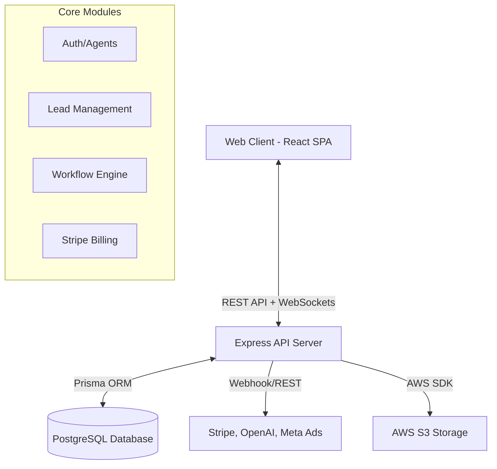

# Architecture

> Generated by /map on 2026-03-22

## Overview
LeadFlowPro is a modular B2B Lead Management and Workflow Automation platform. It uses a monorepo structure encompassing an Express-based Node.js API backend and a React (Vite) frontend application. The platform relies on PostgreSQL for its data store mapped via Prisma ORM, utilizing WebSockets for real-time reactivity and node-cron for complex scheduled workflow executions.

## System Diagram

## Structure & Components

### Backend Modules (`apps/api/src/modules/`)
- **`ai/`**: OpenAI integrations for lead scoring, routing recommendations, and insights.
- **`leads/`**: Core lead intake, deduplication (`lead-deduplication.service.ts`), and assignment logic.
- **`workflows/`**: The rules execution engine, managing triggers (scheduled, webhook, event-driven) and varied node executors.
- **`billing/`**: Stripe subscription and tier management.
- **`campaigns/`**: Marketing campaigns tied to external integrations (e.g., Meta provider).
- **`webhooks/`**: External event receivers for third-party ingestions (Stripe, Lead Vendors).

### Frontend UI (`apps/web/src/pages/`)
- **Workflow Builder** (`WorkflowBuilder.tsx`, `Workflows.tsx`): Uses `@xyflow/react` to allow visual editing of automation nodes.
- **Lead CRM View** (`LeadDetail.tsx`, `Leads.tsx`): Manages prospect status and dynamic activities.
- **Dashboards** (`Dashboard.tsx`, `WorkflowAnalyticsDashboard.tsx`, `BulkScoringDashboard.tsx`): Recharts-driven visual representations of operations.
- **Telephony** (`Telephony.tsx`): Likely integrates embedded dialing or call logging.

## Data Flow
1. **Intake:** Leads are ingested via API endpoints, manual entry, or ad campaign webhooks.
2. **Enrichment & Automation:** Upon creation or status change, the `workflows` engine matches triggers, queues steps, and assesses conditions (sometimes deferring to the `ai` module for scoring/routing).
3. **Execution:** Actions are performed (e.g., sending emails via Nodemailer, routing to specific agents) and logged to `activities` or `audit-logs`.
4. **Real-time Push:** Successes, failures, or assignments broadcast out via `socket.io` to connected client clients.

## Integration Points
| External Service | Type | Purpose |
|------------------|------|---------|
| **Stripe** | REST / Webhook | Subscription handling, billing tier gates. |
| **OpenAI** | REST API | Automated lead text qualification and risk calculation. |
| **Meta Ads** | REST API/Webhook | Sourcing leads from external campaigns. |
| **AWS S3** | Cloud Object Store | Attachment, avatar, and static file offloading. |

## Conventions
- **Naming:** Kebab-case for filenames (`lead-assignment.service.ts`), PascalCase for React components, CamelCase for internal logic functions.
- **Structure:** Domain-driven directories inside `apps/api/src/modules/`. Shared tools in `apps/api/src/shared/`. Monorepo package management utilizing `apps/` and `packages/` workspaces.
- **Testing:** Playwright covers critical end-to-end integration and smoke testing in the root `/e2e` directory.

## Technical Debt
- [ ] Multiple embedded `console.log`, `console.warn`, and `console.error` lines scattered throughout `src/modules/workflows/triggers`, `src/shared/websocket/socket.ts`, etc. These should be substituted with a formal logging framework.
- [ ] **`logger.service.ts`**: "TODO: Send to external logging service (e.g., Sentry, DataDog, CloudWatch)"
- [ ] **`companies.service.ts`**: "TODO Phase 2: encrypt tokens with AWS KMS before storing"
- [ ] Monorepo cross-dependency definitions could be strengthened using workspace aliases rather than traversing `../../node_modules`.
